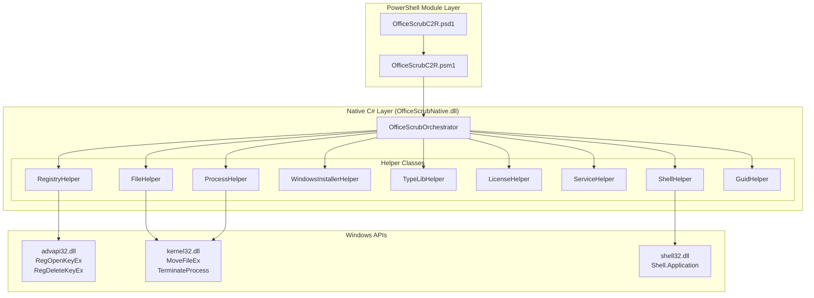

# Overview

Relevant source files

OfficeScrubC2R is a PowerShell module that wraps a native C# library (`OfficeScrubNative.dll`) to perform deep cleanup of Microsoft Office Click-to-Run installations. The module serves as a replacement for Microsoft's legacy `OffScrubC2R.vbs` (v2.19) with 10-50x performance improvements through compiled code and direct Windows API access.

## What Problem Does It Solve?

Office Click-to-Run installations occasionally fail to uninstall through standard Windows mechanisms (`Programs and Features`, ODT uninstall, or `setup.exe /uninstall`). When this occurs, residual registry keys, files, Windows Installer metadata, and COM registrations prevent clean reinstallation. OfficeScrubC2R provides forensic-level cleanup across eight Windows subsystems: Registry (HKLM/HKCU/HKCR with WOW64 support), File System (with locked file handling), Processes, Services, Windows Installer metadata, COM Type Libraries, Software Protection Platform (SPP/OSPP), and Shell Integration.

## Why Does It Exist?

Microsoft's original VBScript solution (`OffScrubC2R.vbs`) suffers from performance limitations inherent to interpreted scripting and COM automation. The PowerShell/C# hybrid architecture achieves dramatic performance gains through:

- **Compiled C# Code**: Native `OfficeScrubNative.dll` replaces interpreted VBScript
- **Direct Win32 APIs**: P/Invoke to `advapi32.dll`, `kernel32.dll`, `shell32.dll` bypasses COM overhead
- **Parallel Processing**: Multi-threaded operations via `Task.Run()` and `Task.WaitAll()`
- **Optimized Data Structures**: `HashSet<string>` for O(1) lookups vs. linear array scans
- **Static Caching**: Reduced repetitive API calls in registry enumeration

## Capabilities and Scope

The system targets Office 2013, 2016, 2019, and Office 365 Click-to-Run installations on Windows 7 SP1 through Windows 11 (both x86 and x64 architectures).

### Core Cleanup Operations

| Subsystem | Implemented By | Key Operations |
|-----------|---------------|----------------|
| **Registry** | `RegistryHelper` | Recursive key deletion across HKLM, HKCU, HKCR with WOW64 dual-path access (`KEY_WOW64_64KEY`, `KEY_WOW64_32KEY`) |
| **File System** | `FileHelper` | Directory deletion with `cmd.exe rd /s /q` optimization; locked file handling via `MoveFileEx(MOVEFILE_DELAY_UNTIL_REBOOT)` |
| **Processes** | `ProcessHelper` | Parallel process termination via `Task.Run()`; `GetProcessesUsingPath()` for file lock detection |
| **Windows Installer** | `WindowsInstallerHelper` | Product/Component/UpgradeCode cleanup using GUID transformation (`GetExpandedGuid`, `GetCompressedGuid`, `GetDecodedGuid`) |
| **COM Type Libraries** | `TypeLibHelper` | Unregister type libraries from `HKCR\TypeLib` and `HKCR\Interface` |
| **SPP/OSPP Licensing** | `LicenseHelper` | Clear Office Software Protection Platform tokens (optional via `-KeepLicense` parameter) |
| **Shell Integration** | `ShellHelper` | Remove published components, taskbar pins, start menu items using `Shell.Application` COM object |
| **Services** | `ServiceHelper` | Delete Office-related Windows services via WMI |

## System Architecture

OfficeScrubC2R implements a two-layer hybrid architecture: a PowerShell wrapper layer for user interaction and a native C# library for performance-critical operations.

### Architecture Overview

